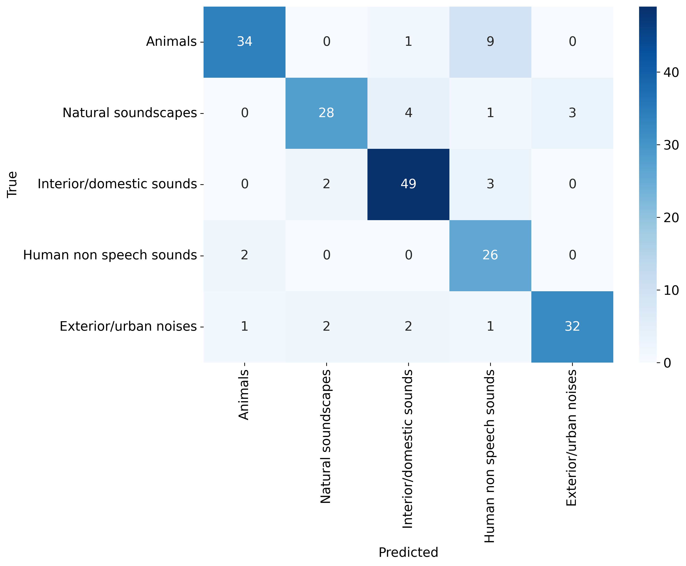
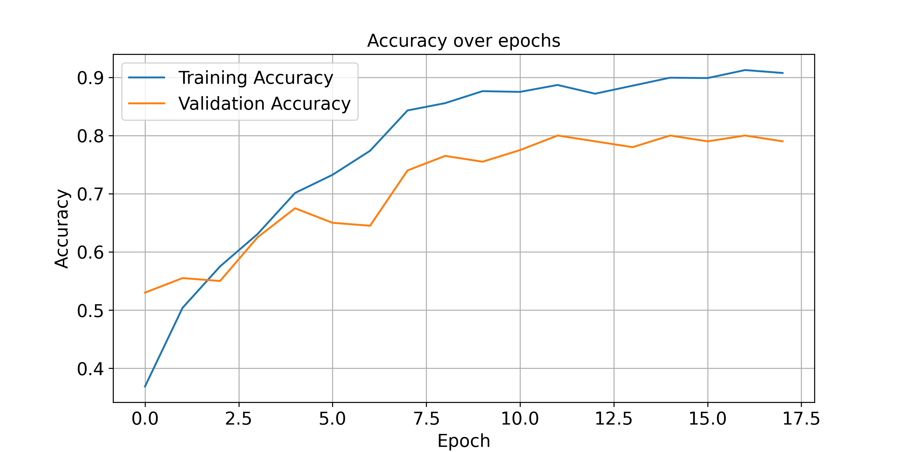

# ESC-50 Audio Classification

This project focuses on classifying environmental audio recordings from the ESC-50 dataset into 5 major categories using a custom ResNet-18 model.

## Table of Contents

- [Project Overview](#project-overview)
- [Dataset](#dataset)
- [Requirements](#requirements)
- [Installation](#installation)
- [Usage](#usage)
- [Model Training](#model-training)
- [Evaluation](#evaluation)
- [Results](#results)
- [Visualization](#visualization)
- [Contributing](#contributing)
- [License](#license)
- [Acknowledgements](#acknowledgements)

## Project Overview

The goal of this project is to classify audio samples from the ESC-50 dataset into 5 major categories:
- Animals
- Natural soundscapes
- Interior/domestic sounds
- Human non-speech sounds
- Exterior/urban noises

We use a custom ResNet-18 model, data augmentation techniques, and various training strategies including early stopping and learning rate scheduling.

## Dataset

The ESC-50 dataset is a labeled collection of 2000 environmental audio recordings organized into 50 classes, with 40 samples per class. The dataset is used for various audio processing tasks and is available at: [ESC-50 dataset](https://github.com/karoldvl/ESC-50).

## Requirements

- Anaconda/Miniconda
- Python 3.12+
- PyTorch
- torchaudio
- torchvision
- scikit-learn
- pandas
- seaborn
- matplotlib

## Installation

1. Clone this repository:
    ```sh
    git clone https://github.com/yourusername/esc50-audio-classification.git
    cd esc50-audio-classification
    ```

2. Create a Conda environment and activate it:
    ```sh
    conda env create -f environment.yml
    conda activate esc50
    ```

3. Download and preprocess the dataset by running:
    ```sh
    python download.py
    ```

### Data distribution


### Sample waveplots 


### Sample spectrograms


## Usage

### Training the Model

To train the model, run the following command:
```sh
python main.py
```

This will:
- Load and preprocess the ESC-50 dataset.
- Combine the 50 classes into 5 major categories.
- Split the dataset into training, validation, and test sets.
- Train the ResNet-18 model with data augmentation.
- Save the trained model and results.

### Evaluation

After training, the model is evaluated on the test set. The script will output the test loss, accuracy, and a confusion matrix to visualize the performance across different classes.

### Visualization

To visualize samples (in time-domain, time-frequency domain), predictions, train/eval plots, and confusion matrix, use the Jupyter Notebook:
```sh
jupyter notebook Play.ipynb
```

## Model Training

The model training involves:
- **Data Augmentation**: Using `torchaudio` transformations such as volume adjustment, time stretching, and masking.
- **Custom ResNet-18**: Modifying the ResNet-18 architecture to handle spectrogram inputs.
- **Early Stopping**: Stopping the training if the validation loss does not improve for a certain number of epochs.
- **Learning Rate Scheduling**: Adjusting the learning rate during training for better convergence.

## Evaluation

The evaluation metrics include:
- **Test Loss**: The average loss on the test set.
- **Test Accuracy**: The percentage of correct predictions on the test set.
- **Confusion Matrix**: A matrix to visualize the performance of the classifier across all classes.

### Example Evaluation Result

```
Test Loss: 0.5835982573032379
Test Accuracy: 0.80
```

## Results

Training and validation loss and accuracy history are saved as CSV files. The test results and confusion matrix are also saved and displayed.

### Confusion Matrix



### Training and Validation Loss


### Training and Validation Accuracy




### Sample Predictions


## Visualization

Visualizations of audio samples, predictions, and plots are available in `Play.ipynb`. These include:

- Time-domain representations
- Time-frequency domain representations (spectrograms)
- Predictions on sample audio clips
- Training and evaluation plots
- Confusion matrix

## Contributing

Contributions are welcome! Please submit a pull request or open an issue to discuss any changes.

## License

This project is licensed under the MIT License.

## Acknowledgements

- [ESC-50 dataset](https://github.com/karoldvl/ESC-50)
- [PyTorch](https://pytorch.org/)
- [torchaudio](https://pytorch.org/audio/)
