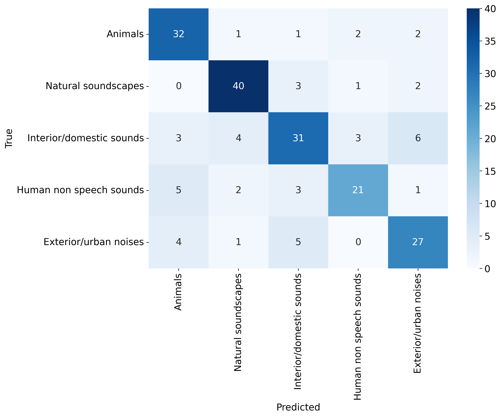
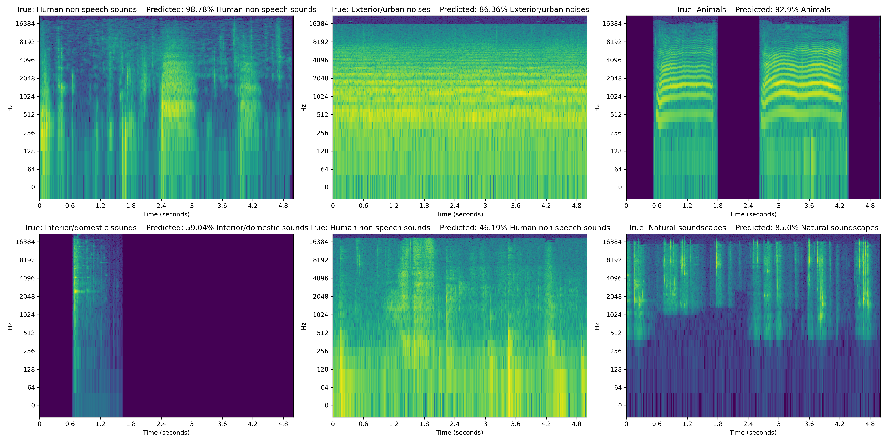

# ESC-50 Audio Classification

This project focuses on classifying environmental audio recordings from the ESC-50 dataset into 5 major categories using a customized 2D CNN model using log spectograms.

## Table of Contents

- [Project Overview](#project-overview)
- [Dataset](#dataset)
- [Requirements](#requirements)
- [Installation](#installation)
- [Usage](#usage)
- [Model Training](#model-training)
- [Evaluation](#evaluation)
- [Results](#results)
- [Visualization](#visualization)
- [Contributing](#contributing)
- [License](#license)
- [Acknowledgements](#acknowledgements)

## Project Overview

The goal of this project is to classify audio samples from the ESC-50 dataset into ```5 major categories``` with ```400 samples per category```. The categories are as follows:
- Animals
- Natural soundscapes
- Interior/domestic sounds
- Human non-speech sounds
- Exterior/urban noises

We use a custom ResNet-18 model, data augmentation techniques, and various training strategies including early stopping and learning rate scheduling.

## Dataset

The ESC-50 dataset is a labeled collection of ```2000``` environmental audio recordings organized into ```50 classes```, with 40 samples per class. The dataset is used for various audio processing tasks and is available at: [ESC-50 dataset](https://github.com/karoldvl/ESC-50). However, the dataset is reorganized into ```5 major categories``` for this project.

## Requirements

- Anaconda/Miniconda
- Python 3.12+
- PyTorch
- torchaudio
- torchvision
- scikit-learn
- pandas
- seaborn
- matplotlib

## Installation

1. Clone this repository:
    ```sh
    git clone https://github.com/yusufbrima/ESD5.git
    cd ESD5
    ```

2. Create a Conda environment and activate it:
    ```sh
    conda env create -f environment.yml
    conda activate esc50
    ```

3. Download and preprocess the dataset by running:
    ```sh
    python download.py
    ```

### Data distribution


### Sample waveplots 


### Sample spectrograms


## Usage

### Training the Model

To train the model, run the following command:
```sh
python main.py
```

This will:
- Load and preprocess the ESC-50 dataset.
- Split the dataset into training, validation, and test sets.
- Train the CNN model.
- Save the trained model and results.

### Evaluation

After training, the model is evaluated on the test set. The script will output the test loss, accuracy, and a confusion matrix to visualize the performance across different classes.

### Visualization

To visualize samples (in time-domain, time-frequency domain), predictions, train/eval plots, and confusion matrix, use the Jupyter Notebook:
```sh
jupyter notebook Visualize.ipynb
```

## Model Training

The model training involves:
- **Customized 2D CNN**: Modifying the CNN architecture to handle log spectrogram inputs.
- **Early Stopping**: Stopping the training if the validation loss does not improve for a certain number of epochs.
- **Learning Rate Scheduling**: Adjusting the learning rate during training for better convergence.

## Evaluation

The evaluation metrics include:
- **Test Loss**: The average loss on the test set.
- **Test Accuracy**: The percentage of correct predictions on the test set.
- **Confusion Matrix**: A matrix to visualize the performance of the classifier across all classes.

### Top-1 Test Evaluation

| Model      | Test Loss     | Test Accuracy |
|------------|----------------|---------------|
| DenseNet121| 0.4892         | 84.50%        |
| ResNet18   | 0.6841         | 75.50%        |


## Results

Training and validation loss and accuracy history are saved as CSV files. The test results and confusion matrix are also saved and displayed.

### Confusion Matrices

<div style="display: flex; flex-direction: row; justify-content: space-between;">
    <div style="flex: 1; text-align: center; margin-right: 10px;">
        <figure>
            
            <figcaption>DenseNet121 Confusion Matrix</figcaption>
        </figure>
    </div>
    <div style="flex: 1; text-align: center; margin-left: 10px;">
        <figure>
            
            <figcaption>ResNet18 Confusion Matrix</figcaption>
        </figure>
    </div>
</div>

### Training and Validation Curves

#### DenseNet

<div style="display: flex; flex-direction: row; justify-content: space-between;">
    <div style="flex: 1; text-align: center; margin-right: 10px;">
        <figure>
            
            <figcaption>DenseNet121 Training and Validation Loss</figcaption>
        </figure>
    </div>
    <div style="flex: 1; text-align: center; margin-left: 10px;">
        <figure>
            
            <figcaption>DenseNet121 Training and Validation Accuracy</figcaption>
        </figure>
    </div>
</div>

#### ResNet

<div style="display: flex; flex-direction: row; justify-content: space-between;">
    <div style="flex: 1; text-align: center; margin-right: 10px;">
        <figure>
            
            <figcaption>ResNet18 Training and Validation Loss</figcaption>
        </figure>
    </div>
    <div style="flex: 1; text-align: center; margin-left: 10px;">
        <figure>
            
            <figcaption>ResNet18 Training and Validation Accuracy</figcaption>
        </figure>
    </div>
</div>


### Sample Predictions

<div style="display: flex; flex-direction: row; justify-content: space-between;">
    <div style="flex: 1; text-align: center; margin-right: 10px;">
        <figure>
            
            <figcaption>DenseNet121 Predictions</figcaption>
        </figure>
    </div>
    <div style="flex: 1; text-align: center; margin-left: 10px;">
        <figure>
            
            <figcaption>ResNet18 Predictions</figcaption>
        </figure>
    </div>
</div>


## Visualization

Visualizations of audio samples, predictions, and plots are available in `Visualize.ipynb`. These include:

- Time-domain representations
- Time-frequency domain representations (spectrograms)
- Predictions on sample audio clips
- Training and evaluation plots
- Confusion matrix


## Ablation Studies

#### DenseNet

| Configuration                                        | Test Accuracy |
|------------------------------------------------------|---------------|
| Standard Model                                       | 0.73          |
| With Weight Decay                                    | 0.76          |
| With Learning Rate Decay (LR=0.0001) 20 epochs       | 0.81          |
| With Learning Rate Decay (LR=0.001) 20 epochs        | 0.75          |
| With Learning Rate Decay (LR=0.0001) 40 epochs       | 0.8250        |
| With Learning Rate Decay (LR=0.001) 40 epochs        | 0.71          |
| With Learning Rate Decay (LR=0.0002) 20 epochs       | 0.77          |
| With Learning Rate Decay (LR=0.0001) 20 epochs w/o log transforms | 0.32          |

#### ResNet18

| Configuration                                        | Test Accuracy |
|------------------------------------------------------|---------------|
| With Learning Rate Decay (LR=0.0001) 20 epochs       | 0.78          |
| With Learning Rate Decay (LR=0.001) 20 epochs        | 0.71          |

#### Model from scratch

| Configuration                                        | Test Accuracy |
|------------------------------------------------------|---------------|
| With Learning Rate Decay (LR=0.0001) 20 epochs       | 0.58          |

#### DenseNet121 with Early Stopping

| Configuration                                        | Test Accuracy |
|------------------------------------------------------|---------------|
| With Learning Rate Decay (LR=0.0001) 20 epochs       | 0.8350        |
## Contributing

Contributions are welcome! Please submit a pull request or open an issue to discuss any changes.

## License

This project is licensed under the MIT License.

## Acknowledgements

- [ESC-50 dataset](https://github.com/karoldvl/ESC-50)
- [PyTorch](https://pytorch.org/)
- [torchaudio](https://pytorch.org/audio/)
